# Lean 引擎支持能力矩阵

> 生成日期: 2026-06-02 | 基于 QuantConnect Lean 核心代码库分析

---

## 目录

- [1. Lean 引擎整体运行架构](#1-lean-引擎整体运行架构)
- [2. 中国内地市场支持总览](#2-中国内地市场支持总览)
- [3. 交易所与市场](#3-交易所与市场)
- [4. 经纪商模型](#4-经纪商模型)
- [5. 期货合约详情](#5-期货合约详情)
- [6. 数据源](#6-数据源)
- [7. 资产类型 (SecurityType)](#7-资产类型-securitytype)
- [8. 基础设施与可扩展性](#8-基础设施与可扩展性)
- [9. 添加中国期货支持的实施路径](#9-添加中国期货支持的实施路径)

---

## 1. Lean 引擎整体运行架构

### 1.1 系统总览

Lean 是一个事件驱动的算法交易引擎，采用模块化 + 插件化架构，通过 MEF (Managed Extensibility Framework) 实现组件的动态发现与加载。其核心设计理念是 **将交易逻辑与经纪商/数据源解耦**，使同一套算法代码可以无缝切换不同的交易环境。

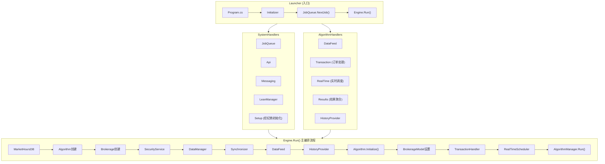

### 1.2 启动流程

引擎启动遵循严格的顺序:

| 阶段 | 组件 | 说明 |
|------|------|------|
| 1 | `Initializer.Start()` | 配置日志系统，加载 MEF Composer |
| 2 | `GetSystemHandlers()` | 从配置文件解析系统级处理器 (JobQueue, Api, Messaging) |
| 3 | `JobQueue.NextJob()` | 获取任务包 — 包含经纪商名称、算法路径、运行模式等 |
| 4 | `GetAlgorithmHandlers()` | 从配置文件解析算法级处理器 (DataFeed, Transaction, Results) |
| 5 | `new Engine(...)` | 创建引擎实例，后台预加载 MarketHoursDatabase 和 SymbolPropertiesDatabase |
| 6 | `Engine.Run()` | 主运行循环 — 见下文详细流程 |

### 1.3 核心运行循环 (`Engine.Run()`)

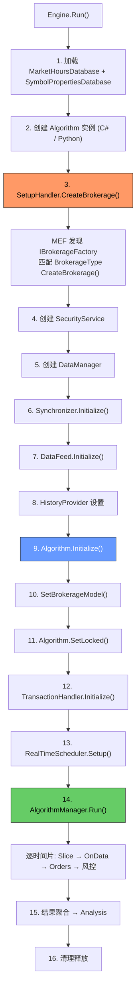

### 1.4 多交易环境支持机制

Lean 通过以下四层抽象实现对多个交易环境的支持:

#### 第一层: 经纪商插件工厂 (IBrokerageFactory)

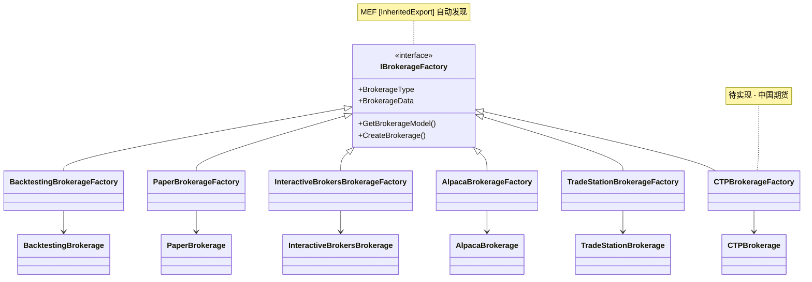

- 每个经纪商实现 `IBrokerageFactory` 接口，标记 `[InheritedExport]`
- MEF `Composer` 在启动时扫描所有 DLL，自动发现并注册工厂
- 运行时通过 `LiveNodePacket.Brokerage` 字符串匹配对应工厂:

```csharp
// BrokerageSetupHandler.cs
_factory = Composer.Instance.Single<IBrokerageFactory>(
    bf => bf.BrokerageType.MatchesTypeName(liveJob.Brokerage));
var brokerage = _factory.CreateBrokerage(liveJob, algorithm);
```

- **切换经纪商只需修改配置中的 `Brokerage` 字段**，无需改动任何代码

#### 第二层: 经纪商模型 (IBrokerageModel)

经纪商模型是回测/模拟时对真实经纪商行为的抽象，定义了:

| 模型组件 | 接口/基类 | 作用 |
|---------|---------|------|
| 手续费模型 | `IFeeModel` | 计算每笔交易的手续费 |
| 保证金模型 | `IBuyingPowerModel` | 计算保证金要求和可用资金 |
| 成交模型 | `IFillModel` | 模拟订单成交价格和数量 |
| 滑点模型 | `ISlippageModel` | 模拟市场价格滑移 |
| 结算模型 | `ISettlementModel` | 处理资金结算 (如 T+2) |
| 杠杆模型 | `GetLeverage()` | 定义各资产类型的最大杠杆 |
| 基准模型 | `IBenchmark` | 定义策略基准 (如 SPY) |

用户算法中通过 `SetBrokerageModel()` 选择模型:

```csharp
// 用户算法代码
SetBrokerageModel(BrokerageName.InteractiveBrokersBrokerage, AccountType.Margin);
// 或
SetBrokerageModel(new MyCTPBrokerageModel());
```

- 同一算法代码切换 `BrokerageModel` 即可适配不同经纪商的费用/保证金规则
- 实盘时模型被真实经纪商 API 替代，但模型仍用于风控检查

#### 第三层: 数据馈送 (IDataQueueHandler + IDataDownloader)

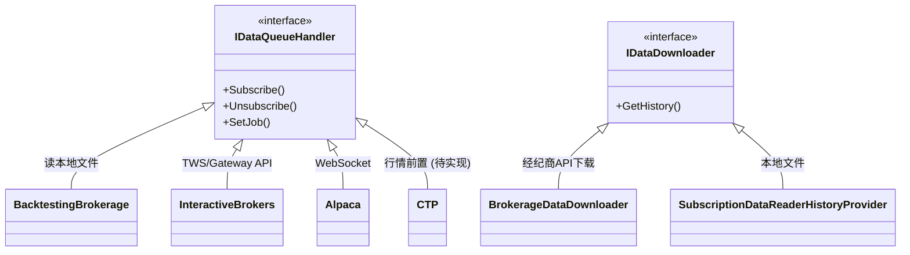

- `DataQueueHandlerManager` 采用**组合模式**管理多个数据处理器
- 支持配置不同的数据源和交易经纪商分离 (如: 用 IB 交易，用 Polygon 取数据):

```csharp
// DataQueueHandlerManager.SetJob()
// LiveNodePacket 中的 DataQueueHandler 字段可以包含逗号分隔的多个处理器名称
var handlers = job.DataQueueHandler.Split(',');
// 为每个 handler 创建对应的经纪商实例用于数据
```

- 数据订阅路由: 每个 `SubscriptionDataConfig` 根据其 `Market` 属性被路由到对应的处理器

#### 第四层: 市场与交易所抽象

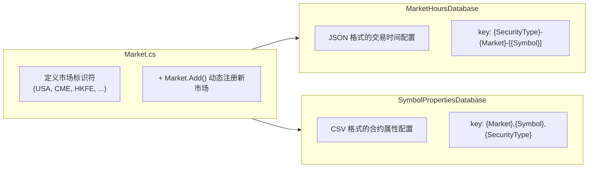

- **MarketHoursDatabase** 通过三元组 `(SecurityType, Market, Symbol)` 查找交易时间
  - 支持通配符: `Future-cme-[*]` 匹配 CME 所有期货的默认交易时间
  - 支持精确匹配: `Future-cbot-ZC` 匹配 CBOT 玉米的特定交易时间
- **SymbolPropertiesDatabase** 定义每个合约的:
  - 最小变动价位 (Tick Size)
  - 合约乘数 (Multiplier)
  - 保证金 (Lot Size)
  - 结算货币

这意味着要支持新交易所，只需:
1. `Market.Add("SHFE", 100)` 注册市场
2. 在 `market-hours-database.json` 添加 `Future-shfe-[*]` 条目
3. 在 `symbol-properties-database.csv` 添加合约属性
4. 引擎自动根据时区 (Asia/Shanghai) 处理时间转换

### 1.5 数据流全景图

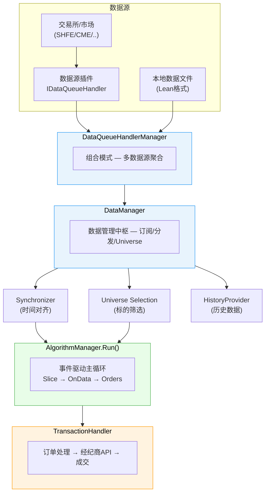

### 1.6 关键扩展点总结

要接入新的交易环境 (如中国期货市场)，需要在以下接口点插入实现:

| 扩展点 | 接口 | 必须/可选 | 说明 |
|--------|------|---------|------|
| 市场注册 | `Market.Add()` | 必须 | 注册交易所标识符 |
| 交易时间 | `market-hours-database.json` | 必须 | 定义交易时段和假日 |
| 合约属性 | `symbol-properties-database.csv` | 必须 | 定义 tick size / 乘数 / 保证金 |
| 合约定义 | `Futures.cs` | 必须 | 定义合约品种符号 |
| 到期规则 | `FuturesExpiryFunctions.cs` | 必须 | 合约到期日计算 |
| 经纪商模型 | `IBrokerageModel` | 必须 | 手续费/保证金/成交模型 |
| 经纪商连接 | `IBrokerage` | 实盘必须 | 订单执行 / 持仓查询 |
| 数据馈送 | `IDataQueueHandler` | 实盘必须 | 实时行情订阅 |
| 插件工厂 | `IBrokerageFactory` | 实盘必须 | MEF 插件发现 |
| 历史数据 | `IBrokerage.GetHistory()` | 可选 | 历史数据下载 |

### 1.7 量化交易完整业务流程中的 Lean 应用

Lean 不仅是一个回测/交易引擎，更提供了覆盖量化交易**全生命周期**的工具链支持。以下展示如何在一个完整的量化策略项目中，从数据探索到策略上线运维，逐步应用 Lean 的各子系统。

```mermaid
flowchart LR
    subgraph Phase1["1. 数据分析"]
        A1["Research / QuantBook\nJupyter Notebook"]
    end
    subgraph Phase2["2. 策略编写"]
        A2["QCAlgorithm\nC# / Python"]
    end
    subgraph Phase3["3. 回测验证"]
        A3["Backtest Engine\n本地/Docker"]
    end
    subgraph Phase4["4. 参数优化"]
        A4["Optimizer\n网格/步进搜索"]
    end
    subgraph Phase5["5. 结果分析"]
        A5["Report Generator\nHTML / PDF"]
    end
    subgraph Phase6["6. 实盘部署"]
        A6["Live Trading\nDocker + Lean CLI"]
    end
    subgraph Phase7["7. 运行跟踪"]
        A7["Live ResultHandler\n实时监控 + 告警"]
    end
    subgraph Phase8["8. 迭代更新"]
        A8["回测对比\n策略版本管理"]
    end

    Phase1 --> Phase2 --> Phase3 --> Phase4 --> Phase5 --> Phase6 --> Phase7 --> Phase8
    Phase8 -.->|反馈循环| Phase1

    style Phase1 fill:#e3f2fd,stroke:#1565C0,color:#000
    style Phase2 fill:#e8f5e9,stroke:#2E7D32,color:#000
    style Phase3 fill:#fff3e0,stroke:#E65100,color:#000
    style Phase4 fill:#fce4ec,stroke:#C62828,color:#000
    style Phase5 fill:#f3e5f5,stroke:#6A1B9A,color:#000
    style Phase6 fill:#e0f2f1,stroke:#00695C,color:#000
    style Phase7 fill:#fff8e1,stroke:#F57F17,color:#000
    style Phase8 fill:#efebe9,stroke:#4E342E,color:#000
```

#### 1.7.1 阶段一: 数据分析与探索 (Research)

Lean 提供 `QuantBook` 交互式分析环境，基于 Jupyter Notebook 实现数据探索和策略原型验证:

| 能力 | 说明 | 关键文件 |
|------|------|---------|
| **Jupyter 集成** | Python + C# 双内核 Notebook | `Research/start.py`, `Initialize.csx` |
| **QuantBook** | 继承 `QCAlgorithm`，在 Notebook 中使用全部引擎 API | `Research/QuantBook.cs` |
| **历史数据请求** | `qb.history()` 自动返回 Pandas DataFrame | 通过 `PandasConverter` 转换 |
| **指标计算** | 在 Notebook 中直接计算 SMA/EMA/RSI 等技术指标 | `QCAlgorithm.Indicators.cs` |
| **数据可视化** | 集成 matplotlib / plotly 绘图 | `AlgorithmImports.py` 加载 matplotlib |
| **Docker 启动** | `lean research` 一键启动 JupyterLab 容器 | `DockerfileJupyter` (端口 8888) |

典型研究工作流:

```python
from AlgorithmImports import *

qb = QuantBook()
# 订阅标的
spy = qb.add_equity("SPY")
# 获取历史数据 (自动返回 DataFrame)
history = qb.history("SPY", 252, Resolution.DAILY)
# 计算技术指标
sma = qb.sma("SPY", 20, Resolution.DAILY)
# 可视化分析
history['close'].plot()
```

Lean 基础镜像内置了 **50+ 个 Python 数据科学包**: pandas, numpy, scipy, scikit-learn, tensorflow, pytorch, statsmodels, matplotlib 等 (`DockerfileLeanFoundation`)。

#### 1.7.2 阶段二: 策略编写 (Algorithm Development)

Lean 支持 C# 和 Python 双语言策略开发，共享同一套引擎能力:

| 开发方式 | 特点 | 适用场景 |
|---------|------|---------|
| **Python 策略** | snake_case 命名、pandas 集成、快速迭代 | 研究导向、快速原型、数据科学密集型 |
| **C# 策略** | 强类型、编译检查、最高性能 | 生产级策略、低延迟交易、大型项目 |
| **Alpha Framework** | 模块化架构 (Alpha → Portfolio → Risk → Execution) | 团队协作、策略组件复用 |

策略核心结构:

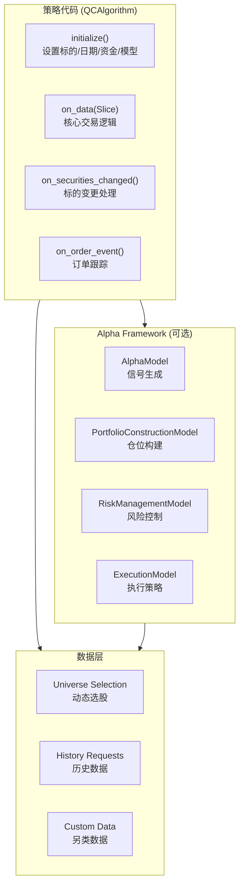

#### 1.7.3 阶段三: 回测验证 (Backtesting)

Lean 的回测系统通过 `config.json` 中的 `environment: "backtesting"` 配置启动:

| 配置项 | 说明 | 示例值 |
|--------|------|-------|
| `algorithm-type-name` | 策略类名 | `"BasicTemplateAlgorithm"` |
| `algorithm-language` | 开发语言 | `"Python"` / `"CSharp"` |
| `algorithm-location` | 文件/DLL 路径 | `"../../../Algorithm.Python/xxx.py"` |
| `data-folder` | 数据目录 | `"../../../Data"` |
| `parameters` | 策略参数 | `{"lookback": "20", "threshold": "0.02"}` |

**同一份策略代码**通过配置切换即可运行在回测或实盘模式，引擎自动替换底层处理器:

| 处理器 | 回测模式 | 实盘模式 |
|--------|---------|---------|
| 数据馈送 | `FileSystemDataFeed` (读本地文件) | `LiveTradingDataFeed` (实时行情) |
| 交易处理 | `BacktestingTransactionHandler` | `BrokerageTransactionHandler` |
| 结果处理 | `BacktestingResultHandler` | `LiveTradingResultHandler` |
| 定时调度 | `BacktestingRealTimeHandler` (同步) | `LiveTradingRealTimeHandler` (多线程) |
| 经纪商 | `BacktestingBrokerage` (模拟成交) | 真实经纪商 API |

运行方式:
- **命令行**: `dotnet QuantConnect.Lean.Launcher.dll`
- **Docker**: `lean backtest --data-provider ...`
- **Lean CLI**: `lean backtest "MyProject"`

#### 1.7.4 阶段四: 参数优化 (Optimization)

Lean 内置参数优化器 (`Optimizer/`)，支持多策略参数搜索:

| 优化策略 | 说明 | 文件 |
|---------|------|------|
| **GridSearch** | 穷举网格搜索所有参数组合 | `GridSearchOptimizationStrategy.cs` |
| **EulerSearch** | 自适应搜索 (粗到细) | `EulerSearchOptimizationStrategy.cs` |
| **StepBase** | 步进搜索，可配置步长 | `StepBaseOptimizationStrategy.cs` |

优化流程:
1. 在配置中定义参数范围和步长 (如 `sma_period: min=5, max=50, step=5`)
2. 定义优化目标 (如最大化夏普比率、最小化最大回撤)
3. 优化器并发启动多个回测进程 (`maximum-concurrent-backtests` 控制并发数)
4. 收集所有回测结果，通过 `OptimizationAnalyzer` 生成统计摘要
5. `OptimizationClustering` 和 `OptimizationSlicing` 提供聚类分析和参数切片视图

运行方式: `lean optimize --strategy "MyProject"` 或 `dotnet QuantConnect.Optimizer.Launcher.dll`

#### 1.7.5 阶段五: 结果分析与报告 (Report Generation)

Lean 的 `Report/` 项目可独立生成专业级策略分析报告:

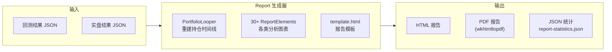

报告涵盖 **30+ 个分析维度**:

| 类别 | 具体指标 |
|------|---------|
| **收益分析** | 年化收益 (CAGR)、累计收益、月度/年度收益热力图、每日收益分布 |
| **风险分析** | 最大回撤、回撤恢复时间、滚动夏普/贝塔、概率夏普比率 (PSR) |
| **交易分析** | 收益/交易比、日均交易数、换手率、杠杆利用率 |
| **资产配置** | 持仓时间线、资产分布、市场分布 |
| **压力测试** | 历史危机事件分析 (15 个内置危机时期) |
| **容量估算** | 策略容量估算 (Estimated Capacity) |

运行方式:
```bash
dotnet QuantConnect.Report.dll \
  --strategy-name "MyStrategy" \
  --backtest-data-source-file backtest.json \
  --live-data-source-file live.json \
  --report-destination ./output/
```

#### 1.7.6 阶段六: 实盘部署 (Deployment)

从回测到实盘的部署路径:

| 步骤 | 操作 | 说明 |
|------|------|------|
| 1 | 修改 `environment` 为实盘环境 | 如 `"live-paper"`, `"live-interactive"` |
| 2 | 配置经纪商连接 | 填写经纪商 API 密钥、前置地址等 |
| 3 | 配置数据源 | 选择 `DataQueueHandler` (如 IB, CTP) |
| 4 | 设置初始资金和持仓 | `live-cash-balance`, `live-holdings` |
| 5 | Docker 部署 | `lean live "MyProject"` |

`config.json` 中预置了 **25+ 个实盘环境配置**，涵盖所有已支持的经纪商:

```json
"live-paper": {
    "live-mode": true,
    "setup-handler": "BrokerageSetupHandler",
    "transaction-handler": "BacktestingTransactionHandler",  // Paper 用模拟交易
    "data-feed-handler": "LiveTradingDataFeed",
    "real-time-handler": "LiveTradingRealTimeHandler"
}
```

Docker 部署架构:

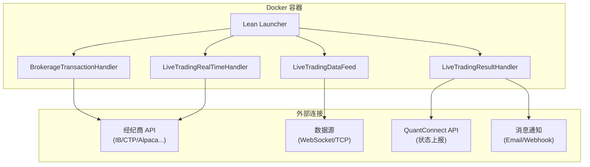

#### 1.7.7 阶段七: 运行跟踪与监控 (Live Monitoring)

实盘运行期间，`LiveTradingResultHandler` 提供:

| 监控能力 | 机制 | 频率 |
|---------|------|------|
| **权益曲线** | 定时采样 Equity / Holdings / P&L | 实时 |
| **订单跟踪** | 每笔订单状态变更推送 | 实时 |
| **运行时统计** | 胜率、盈亏比、持仓时间等 | 持续更新 |
| **状态上报** | `Api` 组件向 QuantConnect Cloud 上报算法状态 | 周期性 |
| **消息通知** | `Messaging` 组件发送 Email / Webhook 告警 | 事件触发 |
| **经纪商消息** | `OnBrokerageMessage()` / `OnBrokerageDisconnect()` 回调 | 事件触发 |
| **保证金预警** | `OnMarginCall()` / `OnMarginCallWarning()` 回调 | 每5分钟 |

策略中可注册自定义监控:

```python
def initialize(self):
    # 注册自定义图表
    self.add_chart(Chart("Custom Metrics"))
    # 定时发送状态报告
    self.schedule.on("daily-report",
        self.date_rules.every_day(),
        self.time_rules.at(16, 0),
        self.send_daily_report)

def send_daily_report(self):
    self.debug(f"Portfolio: {self.portfolio.total_portfolio_value}")
```

#### 1.7.8 阶段八: 迭代更新 (Iteration)

策略上线后的持续迭代闭环:

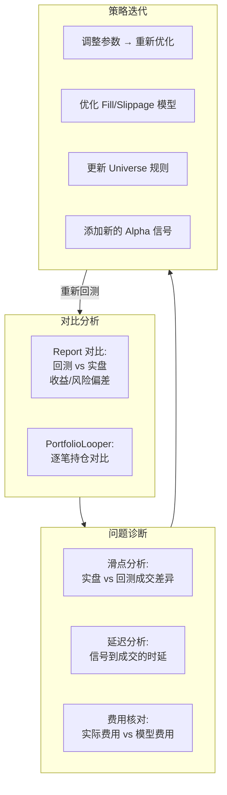

Lean 支持的关键迭代能力:

| 能力 | 说明 |
|------|------|
| **回测-实盘对比** | Report 项目同时接收回测和实盘 JSON，生成对比报告 |
| **样本外验证** | Optimizer 支持 out-of-sample 参数 (`out-of-sample-days`) |
| **参数热更新** | `config.json` 的 `parameters` 字段可快速切换策略参数 |
| **模型可替换** | 同一策略可替换 FillModel / SlippageModel / FeeModel 以更贴近实际 |
| **Git 版本管理** | 策略代码 + 配置 + 数据全部文件化，适合 Git 管理 |
| **Docker 镜像固化** | 每次构建的 Docker 镜像可标记版本，确保环境一致性 |

#### 1.7.9 完整工具链总结

| 阶段 | Lean 工具 | 入口命令 |
|------|----------|---------|
| 数据分析 | Research / QuantBook / JupyterLab | `lean research` |
| 策略编写 | QCAlgorithm (C# / Python) | IDE / VS Code (.devcontainer) |
| 数据获取 | ToolBox / DownloaderDataProvider | `dotnet ToolBox.dll` / `DownloaderDataProvider.dll` |
| 回测验证 | Engine + BacktestResultHandler | `lean backtest` |
| 参数优化 | Optimizer (Grid/Euler/Step) | `lean optimize` |
| 报告生成 | Report (HTML/PDF/JSON) | `dotnet Report.dll` |
| 实盘部署 | Engine + LiveResultHandler + Docker | `lean live` |
| 运行监控 | LiveResultHandler + Messaging + Api | 引擎内置 |
| 迭代对比 | Report (backtest vs live) + Optimizer | 同上 |

### 1.8 Python 算法编写支持体系

Lean 引擎通过 **PythonNet** 实现了 C# 与 Python 的双语言支持，使 Python 算法可以完全复用 C# 引擎的全部功能。

#### 1.8.1 Python 运行时集成架构

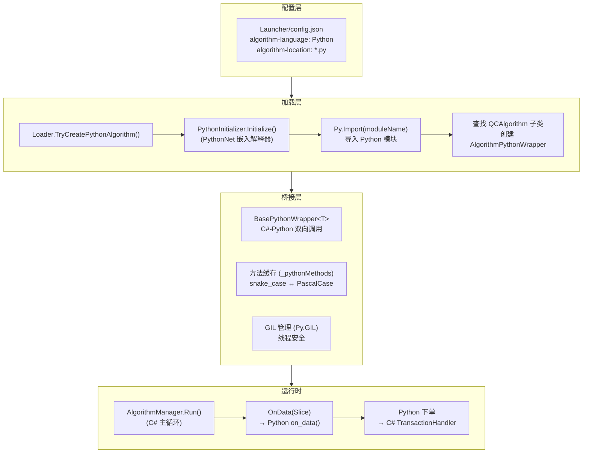

关键依赖: `QuantConnect.pythonnet 2.0.54` (QuantConnect 维护的 pythonnet 分支，增加了 `System.Decimal` 和 `System.DateTime` 支持)。

#### 1.8.2 Python 模块体系

`AlgorithmImports.py` 是 Python 算法的统一入口模块，负责:

| 加载内容 | 说明 |
|---------|------|
| `QuantConnect.*.dll` 全部程序集 | 通过 `clr.AddReference()` 加载所有 C# 程序集 |
| `QuantConnect.Algorithm` | QCAlgorithm 基类 + 所有算法接口 |
| `QuantConnect.Data.*` | 数据类型 (TradeBar, QuoteBar, Tick, Slice...) |
| `QuantConnect.Orders` | 订单类型和下单方法 |
| `QuantConnect.Indicators` | 技术指标库 (SMA, EMA, RSI, MACD, BollingerBands...) |
| `QuantConnect.Securities` | 证券类型和属性模型 |
| `QuantConnect.Algorithm.Framework.*` | Alpha / Portfolio / Risk / Execution 模型 |
| `numpy`, `pandas`, `matplotlib` | 可选的数据科学工具库 |
| `datetime`, `typing`, `math`, `json` | Python 标准库 |

Python 算法标准模板:

```python
from AlgorithmImports import *

class MyAlgorithm(QCAlgorithm):
    def initialize(self):
        self.set_start_date(2020, 1, 1)
        self.set_end_date(2024, 12, 31)
        self.set_cash(100000)
        self.add_equity("SPY", Resolution.MINUTE)
        # 添加技术指标
        self.sma = self.sma("SPY", 20, Resolution.DAILY)

    def on_data(self, data: Slice):
        if not self.portfolio.invested and self.sma.is_ready:
            self.set_holdings("SPY", 1)

    def on_securities_changed(self, changes):
        for security in changes.added_securities:
            self.debug(f"Added: {security.symbol}")
```

#### 1.8.3 C#-Python 桥接包装器体系

Lean 为 **30+ 个 C# 接口**提供了 Python 包装器，使 Python 类可以直接实现这些接口:

| 类别 | 包装器类 | 对应接口 |
|------|---------|---------|
| **算法核心** | `AlgorithmPythonWrapper` | `IAlgorithm` |
| **费用模型** | `FeeModelPythonWrapper` | `IFeeModel` |
| **成交模型** | `FillModelPythonWrapper` | `IFillModel` |
| **滑点模型** | `SlippageModelPythonWrapper` | `ISlippageModel` |
| **保证金模型** | `BuyingPowerModelPythonWrapper` | `IBuyingPowerModel` |
| **波动率模型** | `VolatilityModelPythonWrapper` | `IVolatilityModel` |
| **结算模型** | `SettlementModelPythonWrapper` | `ISettlementModel` |
| **聚合器** | `DataConsolidatorPythonWrapper` | `IDataConsolidator` |
| **期权定价** | `OptionPriceModelPythonWrapper` | `IOptionPriceModel` |
| **经纪商模型** | `BrokerageModelPythonWrapper` | `IBrokerageModel` |
| **基准** | `BenchmarkPythonWrapper` | `IBenchmark` |
| **Alpha 模型** | `AlphaModelPythonWrapper` | `IAlphaModel` |
| **执行模型** | `ExecutionModelPythonWrapper` | `IExecutionModel` |
| **组合构建** | `PortfolioConstructionModelPythonWrapper` | `IPortfolioConstructionModel` |
| **风险管理** | `RiskManagementModelPythonWrapper` | `IRiskManagementModel` |

桥接层的关键设计:

- **命名约定双映射**: 自动将 Python 的 `snake_case` 映射到 C# 的 `PascalCase`，如 `on_data` → `OnData`
- **方法缓存**: `_pythonMethods` 字典缓存已解析的 Python 方法引用，避免每次调用时重复查找
- **GIL 安全**: 所有 C# → Python 调用均在 `using (Py.GIL())` 块中执行，确保线程安全
- **类型转换**: `PythonRuntimeChecker` 提供 C# ↔ Python 的类型安全转换和错误诊断

#### 1.8.4 Framework 模型 Python 支持

Lean 的 Alpha 框架 (Alpha Model Framework) 完全支持 Python 实现:

```python
class MyAlphaModel(AlphaModel):
    def update(self, algorithm, data):
        insights = []
        # 生成交易信号
        insights.append(
            Insight.price("SPY", timedelta(days=1), InsightDirection.UP)
        )
        return insights

    def on_securities_changed(self, algorithm, changes):
        # 处理标的变更
        pass

# 在算法中使用
class FrameworkAlgorithm(QCAlgorithm):
    def initialize(self):
        self.set_alpha(MyAlphaModel())
        self.set_portfolio_construction(EqualWeightingPortfolioConstructionModel())
        self.set_execution(ImmediateExecutionModel())
        self.set_risk_management(MaximumDrawdownPercentPerSecurity(0.01))
```

#### 1.8.5 数据科学与 Pandas 集成

Lean 内置了 Pandas 数据转换支持:

| 功能 | 实现方式 | 说明 |
|------|---------|------|
| **历史数据 → DataFrame** | `PandasConverter` | `self.history("SPY", 100, Resolution.DAILY)` 自动返回 DataFrame |
| **Slice → DataFrame** | `PandasConverter` | 可将当前切片数据转为 DataFrame 进行分析 |
| **自定义指标** | `PythonIndicator` | 用 Python 实现自定义技术指标 |
| **NumPy 混合运算** | 直接调用 | Python `np.sin()` 与 C# `Math.Sin()` 可混合使用 |
| **自定义数据** | `PythonData` | 用纯 Python 定义新的数据类型 (Reader/GetSource) |

自定义数据示例:

```python
class Bitcoin(PythonData):
    def get_source(self, config, date, is_live_mode):
        return SubscriptionDataSource("https://api.example.com/btc")

    def reader(self, config, line, date, is_live_mode):
        coin = Bitcoin()
        coin.symbol = config.symbol
        data = json.loads(line)
        coin.end_time = date + timedelta(days=1)
        coin.value = data["price"]
        return coin
```

#### 1.8.6 Python 环境与包管理

| 配置项 | 说明 |
|--------|------|
| Python 版本 | 3.11 (推荐 3.11.11) |
| 必要包 | `pandas==2.2.3`, `wrapt==1.16.0` |
| 虚拟环境 | 通过 `config.json` 的 `python-venv` 键配置 |
| DLL 路径 | 环境变量 `PYTHONNET_PYDLL` 指向 `python311.dll` |
| 自动补全 | `pip install quantconnect-stubs` 提供 IDE 代码提示 |
| Conda 支持 | `conda create -n qc_lean python=3.11.11 pandas=2.2.3 wrapt=1.16.0` |

Python 虚拟环境激活流程 (`PythonInitializer.ActivatePythonVirtualEnvironment()`):
1. 读取 `pyvenv.cfg` 检查 `include-system-site-packages`
2. 设置 `sys.prefix` 和 `sys.exec_prefix` 为虚拟环境路径
3. 调用 `site.main()` 重新初始化站点包
4. 根据配置决定是否移除系统站点包

#### 1.8.7 Python 可覆写的全部事件回调

| C# 方法 | Python 方法名 | 触发时机 |
|---------|-------------|---------|
| `Initialize()` | `initialize` | 算法初始化 |
| `OnData(Slice)` | `on_data` | 每个有数据的时间片 |
| `OnSecuritiesChanged()` | `on_securities_changed` | Universe 标的变更 |
| `OnOrderEvent()` | `on_order_event` | 订单状态变化 |
| `OnEndOfDay()` | `on_end_of_day` | 交易日结束 |
| `OnEndOfAlgorithm()` | `on_end_of_algorithm` | 算法运行结束 |
| `OnMarginCall()` | `on_margin_call` | 保证金预警 |
| `OnBrokerageDisconnect()` | `on_brokerage_disconnect` | 经纪商断连 |
| `OnBrokerageReconnect()` | `on_brokerage_reconnect` | 经纪商重连 |
| `OnBrokerageMessage()` | `on_brokerage_message` | 经纪商消息 |
| `OnSplits()` | `on_splits` | 股票拆分 |
| `OnDividends()` | `on_dividends` | 分红事件 |
| `OnDelistings()` | `on_delistings` | 退市事件 |
| `OnSymbolChangedEvents()` | `on_symbol_changed_events` | Symbol 变更 |
| `OnAssignmentOrderEvent()` | `on_assignment_order_event` | 期权行权 |
| `OnWarmupFinished()` | `on_warmup_finished` | 预热完成 |
| `OnCommand(dynamic)` | `on_command` | 自定义命令 |

---

## 2. 中国内地市场支持总览

### 结论: 当前不支持任何中国内地交易所、期货合约或交易平台

| 维度 | 状态 | 说明 |
|------|------|------|
| 中国内地期货交易所 | **不支持** | SHFE / DCE / CZCE / CFFEX / INE 均无定义 |
| 中国内地股票交易所 | **不支持** | SSE / SZSE 均无定义 |
| 中国内地交易/数据平台 | **不支持** | CTP / 恒生 / 易盛 / 飞马 / 金仕达 均无实现 |
| 中国内地数据源 | **不支持** | 无 Wind / Choice / Tushare 等集成 |
| 中国相关间接品种 | **支持** | CME 上市的 FTSE China 50、USD/CNH 期货 |
| 基础设施预留 | **可用** | 时区、货币、国家代码、动态 Market.Add() 均已就绪 |

---

## 3. 交易所与市场

### 3.1 中国内地交易所 (全部不支持)

| 交易所 | 代码 | 类型 | 状态 | 说明 |
|--------|------|------|------|------|
| 上海期货交易所 | SHFE | 商品期货 | **不支持** | `Market.cs` 中无市场常量，无合约定义，无交易时间 |
| 大连商品交易所 | DCE | 商品期货 | **不支持** | 同上 |
| 郑州商品交易所 | CZCE | 商品期货 | **不支持** | 同上 |
| 中国金融期货交易所 | CFFEX | 金融期货 | **不支持** | 同上 |
| 上海国际能源交易中心 | INE | 能源期货 | **不支持** | 同上 |
| 上海证券交易所 | SSE | 股票/指数 | **不支持** | 无市场常量，无股票定义 |
| 深圳证券交易所 | SZSE | 股票/指数 | **不支持** | 同上 |

### 3.2 已支持的期货交易所 (12 个)

| 交易所 | Market ID | 地区 | 主要品种类别 | 市场时间条目数 |
|--------|-----------|------|-------------|---------------|
| CME (芝加哥商业交易所) | `cme` | 美国 | 股指、外汇、畜产、林业 | ~75 |
| CBOT (芝加哥期货交易所) | `cbot` | 美国 | 谷物、国债、股指、能源 | ~25 |
| NYMEX (纽约商业交易所) | `nymex` | 美国 | 能源、金属 | ~82 |
| COMEX (商品交易所) | `comex` | 美国 | 贵金属 (金、银、铜) | ~9 |
| ICE (洲际交易所) | `ice` | 美国/英国 | 外汇、软商品、能源 | ~9 |
| CFE (CBOE 期货交易所) | `cfe` | 美国 | VIX 波动率指数 | ~3 |
| CME Globex | `cmeglobex` | 美国 | 电子交易 | — |
| EUREX | `eurex` | 欧洲 | DAX、Euro STOXX 50 | ~3 |
| SGX (新加坡交易所) | `sgx` | 亚洲 | 日经225、MSCI台湾、Nifty | ~4 |
| HKFE (香港期货交易所) | `hkfe` | 亚洲 | 恒生指数 | ~4 |
| OSE (大阪证券交易所) | `ose` | 亚洲 | 股指 | ~2 |
| NYSELIFFE | `nyseliffe` | 欧洲 | MSCI 指数 | ~1 |

### 3.3 已支持的股票/指数市场 (3 个)

| 市场 | Market ID | 地区 | 状态 |
|------|-----------|------|------|
| USA (NYSE / NASDAQ 等) | `usa` | 北美 | 支持 |
| India (NSE) | `india` | 亚洲 | 支持 |
| CBOE (指数) | `cboe` | 美国 | 支持 |

### 3.4 已支持的外汇/差价合约市场 (4 个)

| 市场 | Market ID | 类型 | 状态 |
|------|-----------|------|------|
| OANDA | `oanda` | 外汇 / CFD | 支持 |
| FXCM | `fxcm` | 外汇 / CFD | 支持 |
| Interactive Brokers | `interactivebrokers` | CFD | 支持 |
| Dukascopy | `dukascopy` | 数据提供商 | 部分 |

### 3.5 已支持的加密货币交易所 (16 个)

| 交易所 | Market ID | 状态 |
|--------|-----------|------|
| Binance | `binance` | 支持 |
| Binance US | `binanceus` | 支持 |
| Coinbase | `coinbase` | 支持 |
| Kraken | `kraken` | 支持 |
| Bitfinex | `bitfinex` | 支持 |
| Bybit | `bybit` | 支持 |
| dYdX | `dydx` | 支持 |
| Bitstamp | `bitstamp` | 支持 |
| Poloniex | `poloniex` | 支持 |
| Bithumb | `bithumb` | 支持 |
| Coinone | `coinone` | 支持 |
| HitBTC | `hitbtc` | 支持 |
| OkCoin | `okcoin` | 支持 |
| Bittrex | `bittrex` | 支持 |
| FTX | `ftx` | 已废弃 |
| FTX US | `ftxus` | 已废弃 |

---

## 4. 经纪商模型

### 4.1 中国内地交易/数据平台 (全部不支持)

| 平台 | 类型 | 状态 | 说明 |
|------|------|------|------|
| CTP (综合交易平台) | 期货交易与数据 | **不支持** | 无 IBrokerage 实现，无 IDataQueueHandler |
| 恒生 (Hundsun) | 经纪/交易 | **不支持** | 代码中无任何引用 |
| 易盛 (Esunny) | 期货交易 | **不支持** | 代码中无任何引用 |
| 飞马 (Feima) | 期货交易 | **不支持** | 代码中无任何引用 |
| 金仕达 (Kingstar) | 经纪/交易 | **不支持** | 代码中无任何引用 |
| 同花顺 / 东方财富 | 股票交易 | **不支持** | 代码中无任何引用 |

### 4.2 已支持的经纪商模型矩阵 (33 个)

> 注: 实际的 IBrokerage + IDataQueueHandler 实现在外部插件仓库中。核心仓库包含用于回测/模拟的经纪商模型。

#### 支持期货交易的经纪商 (10 个)

| 经纪商模型 | Equity | Option | Future | FutOpt | IdxOpt | Index | Forex | CFD | Crypto | CryptoFut |
|-----------|--------|--------|--------|--------|--------|-------|-------|-----|--------|-----------|
| **Default** | Y | Y | Y | Y | Y | Y | Y | Y | Y | Y |
| **Interactive Brokers** | Y | Y | Y | Y | Y | Y | Y | Y | - | - |
| **Interactive Brokers (FIX)** | Y | Y | Y | Y | Y | Y | Y | Y | - | - |
| **TradeStation** | Y | Y | Y | - | Y | - | - | - | - | - |
| **Tastytrade** | Y | Y | Y | Y | Y | - | - | - | - | - |
| **Trading Technologies** | - | - | Y | - | - | - | - | - | - | - |
| **Exante** | Y | Y | Y | - | - | Y | Y | Y | Y | - |
| **Eze** | Y | Y | Y | Y | Y | Y | - | - | - | - |
| **Samco** (印度) | Y | Y | Y | - | - | - | - | - | - | - |
| **AlphaStreams** | Y | Y | Y | Y | Y | Y | Y | Y | Y | Y |

#### 仅支持加密期货的经纪商 (4 个)

| 经纪商模型 | Crypto | CryptoFut | 说明 |
|-----------|--------|-----------|------|
| **Binance Futures** | Y | Y | USD-M 加密期货 |
| **Binance Coin Futures** | Y | Y | COIN-M 加密期货 |
| **Bybit** | Y | Y | 加密永续合约 |
| **dYdX** | - | Y | 加密永续合约 |

#### 不支持期货的经纪商 (19 个)

| 经纪商模型 | 支持的资产类型 | 主要市场 |
|-----------|--------------|---------|
| **Alpaca** | Equity, Option, Crypto | USA |
| **Tradier** | Equity, Option, IndexOption | USA |
| **Charles Schwab** | Equity, Option, IndexOption | USA |
| **Webull** | Equity, Option, IndexOption | USA |
| **Wolverine** | Equity, Option | USA |
| **Binance** | Crypto, CryptoFuture | Binance |
| **Binance US** | Crypto, CryptoFuture (1x) | BinanceUS |
| **Coinbase** | Crypto | Coinbase |
| **Kraken** | Crypto | Kraken |
| **Bitfinex** | Crypto | Bitfinex |
| **OANDA** | Forex, CFD | Oanda |
| **FXCM** | Forex, CFD | FXCM |
| **Zerodha** (印度) | Equity | India |
| **Axos Clearing** | Equity | USA |
| **TD Ameritrade** | Equity | USA |
| **RBI** | Equity | USA |
| **FTX** | Crypto | FTX |
| **FTX US** | Crypto | FTXUS |
| **GDAX** (已废弃) | Crypto | Coinbase |

### 4.3 经纪商默认市场分配

| 经纪商 | 股票市场 | 加密市场 | 外汇市场 | 期货市场 |
|--------|---------|---------|---------|---------|
| Default | USA | Coinbase | Oanda | CME |
| Interactive Brokers | USA | - | Oanda | CME |
| TradeStation | USA | Coinbase | Oanda | CME |
| Tastytrade | USA | Coinbase | Oanda | CME |
| Trading Technologies | - | - | - | CME |
| Samco | **India** | Coinbase | Oanda | **India** |
| Zerodha | **India** | Coinbase | Oanda | CME |
| Binance | USA | **Binance** | Oanda | CME |
| Bybit | USA | **Bybit** | Oanda | **Bybit** |
| dYdX | USA | Coinbase | Oanda | **DYDX** |
| OANDA | USA | - | **Oanda** | - |
| FXCM | USA | - | **FXCM** | - |

---

## 5. 期货合约详情

### 5.1 中国内地期货合约 (全部不支持)

| 交易所 | 典型合约 | 状态 | 说明 |
|--------|---------|------|------|
| **SHFE** | CU (铜), AL (铝), RB (螺纹钢), RU (橡胶), AU (黄金), AG (白银), FU (燃油) 等 | **不支持** | `Futures.cs` 中无合约定义 |
| **DCE** | C (玉米), CS (淀粉), A (豆一), M (豆粕), Y (豆油), I (铁矿石), JD (鸡蛋), L (塑料), PP (聚丙烯) 等 | **不支持** | 同上 |
| **CZCE** | CF (棉花), SR (白糖), TA (PTA), OI (菜油), RM (菜粕), MA (甲醇), FG (玻璃) 等 | **不支持** | 同上 |
| **CFFEX** | IF (沪深300), IH (上证50), IC (中证500), IM (中证1000), T (10年国债), TF (5年国债), TS (2年国债), IO/MO (期权) | **不支持** | 同上 |
| **INE** | SC (原油), NR (20号胶), LU (低硫燃油), BC (国际铜) | **不支持** | 同上 |

### 5.2 已支持的期货品种类别

| 类别 | 交易所 | 合约数量 (约) | 代表品种 |
|------|--------|-------------|---------|
| **股指** | CME, CBOT, CFE, EUREX, SGX, HKFE, OSE, NYSELIFFE | ~35 | ES (标普500), NQ (纳指100), YM (道指), VX (VIX), FESX (欧洲STOXX50), HSI (恒生) |
| **能源** | NYMEX, ICE, CBOT | ~65 | CL (WTI原油), NG (天然气), RB (汽油), HO (取暖油), B (布伦特原油) |
| **金属** | COMEX, NYMEX | ~12 | GC (黄金), SI (白银), HG (铜), PL (铂金), PA (钯金) |
| **谷物** | CBOT | ~11 | ZC (玉米), ZS (大豆), ZW (小麦), ZM (豆粕), ZL (豆油) |
| **外汇** | CME, ICE | ~40 | 6E (欧元), 6B (英镑), 6J (日元), DX (美元指数), CNH (离岸人民币) |
| **国债** | CBOT, CME | ~15 | ZB (30年), ZN (10年), ZF (5年), ZT (2年) |
| **软商品** | ICE, NYMEX | ~6 | CT (棉花), KC (咖啡), SB (糖), CC (可可), OJ (橙汁) |
| **畜产** | CME | ~3 | LE (活牛), GF (架子牛), HE (瘦猪) |
| **林业** | CME | ~2 | LBS (木材) |

### 5.3 中国相关期货 (在非中国交易所上市)

| 合约名称 | 代码 | 交易所 | 状态 |
|---------|------|--------|------|
| E-Mini FTSE China 50 Index | FT5 | CME | 支持 |
| Standard-Size USD/Offshore RMB | CNH | CME | 支持 |
| Micro USD/CNH | MNH | CME | 支持 |

---

## 6. 数据源

### 6.1 中国内地数据源 (全部不支持)

| 数据源 | 类型 | 状态 | 说明 |
|--------|------|------|------|
| CTP 行情数据 | 实时期货行情 | **不支持** | 无 IDataQueueHandler 实现 |
| SHFE / DCE / CZCE / CFFEX 交易所直连 | 交易所数据 | **不支持** | 无任何集成 |
| Wind (万得) | 金融数据终端 | **不支持** | 无集成 |
| Choice (东方财富) | 金融数据终端 | **不支持** | 无集成 |
| Tushare | 开源金融数据 | **不支持** | 无集成 |
| SSE / SZSE 行情 | 股票实时数据 | **不支持** | 无集成 |
| 中国A股基本面数据 | 基本面 | **不支持** | 无集成 |

### 6.2 已支持的数据源

| 数据源 | 类型 | 覆盖市场 | 状态 |
|--------|------|---------|------|
| **Lean 本地数据文件** | 价格 (OHLCV / Tick / Quote) | 所有已支持市场 | 支持 |
| **经纪商历史数据** (IBrokerage.GetHistory) | 历史价格 | 取决于经纪商 | 支持 |
| **Intrinio (FRED)** | 宏观经济指标 | 美国宏观、全球汇率、大宗商品 | 部分 |
| **Tiingo API** | 日线股票价格 | 美国股票 | 支持 |
| **FXCM 成交量** | 外汇成交量/交易数据 | 14 个货币对 | 支持 |
| **AlgoSeek** | 期货 (Tick/成交/报价) | 美国期货 | 支持 |
| **Kaiko** | 加密货币 (Tick/订单簿) | 加密交易所 | 支持 |
| **随机数据生成器** | 合成测试数据 | 任意配置市场 | 支持 |

### 6.3 Intrinio 中国相关经济指标 (间接)

| 指标名称 | 代码 | 状态 |
|---------|------|------|
| CBOE China ETF Volatility Index | `$VXFXICLS` | 间接 |
| Chinese Yuan to One US Dollar | `$DEXCHUS` | 间接 |
| Trade-Weighted USD (Broad, 含中国) | `$DTWEXB` | 间接 |
| Trade-Weighted USD (Other Partners, 含中国) | `$DTWEXO` | 间接 |

### 6.4 工具链数据转换器

| 转换器 | 数据类型 | 说明 |
|--------|---------|------|
| AlgoSeek Futures Converter | 期货 Tick/成交/报价 | 将 AlgoSeek 原始数据转为 Lean 格式 |
| Kaiko Crypto Converter | 加密货币 Tick/订单簿 | 将 Kaiko 原始数据转为 Lean 格式 |
| Coarse Universe Generator | 股票粗选数据 | 从日线数据生成粗选宇宙文件 |
| Random Data Generator | 合成数据 | 生成 Equity / Option / Future / Forex / Crypto 随机数据 |

---

## 7. 资产类型 (SecurityType)

| SecurityType | 说明 | 默认市场 | 中国内地支持 | 全局状态 |
|-------------|------|---------|-------------|---------|
| **Equity** | 股票 | USA | **不支持** — 无 SSE/SZSE | 支持 |
| **Option** | 股票期权 | USA | **不支持** — 无中国期权 | 支持 |
| **Future** | 期货合约 | CME | **不支持** — 无 SHFE/DCE/CZCE/CFFEX/INE | 支持 |
| **FutureOption** | 期货期权 | CME | **不支持** — 无中国期货期权 | 支持 |
| **Index** | 市场指数 | USA | **不支持** — 无 CSI 300/SSE 50 等 | 支持 |
| **IndexOption** | 指数期权 | USA | **不支持** — 无中国指数期权 | 支持 |
| **Forex** | 外汇 | Oanda | **部分** — CNH 可通过 OANDA/IB/FXCM 交易 | 支持 |
| **Cfd** | 差价合约 | Oanda | **不支持** | 支持 |
| **Crypto** | 加密货币 | Coinbase | N/A (去中心化) | 支持 |
| **CryptoFuture** | 加密期货 | Binance | N/A (去中心化) | 支持 |
| **Commodity** | 实物商品 | N/A | **不支持** | 部分 |

---

## 8. 基础设施与可扩展性

### 8.1 已就绪的中国市场基础设施

| 组件 | 文件位置 | 状态 | 说明 |
|------|---------|------|------|
| `Market.Add()` 动态注册 | `Common/Market.cs` | 可用 | 可在运行时注册 SHFE/DCE/CZCE/CFFEX/INE (ID < 1000) |
| `TimeZones.Shanghai` | `Common/TimeZones.cs` | 可用 | `Asia/Shanghai` 时区已预定义 |
| `TimeZones.HongKong` | `Common/TimeZones.cs` | 可用 | `Asia/Hong_Kong` 时区已预定义 |
| `Currencies.CNH` / `CNY` | `Common/Currencies.cs` | 可用 | CNH (离岸) + CNY (在岸) 符号已定义 |
| `Country.China` | `Common/Country.cs` | 可用 | ISO 代码 "CHN" 已定义 |
| `Futures.cs` 可扩展结构 | `Common/Securities/Future/Futures.cs` | 可用 | 可添加中国期货品种分类 |
| `FuturesExpiryFunctions` 字典 | `Common/Securities/Future/FuturesExpiryFunctions.cs` | 可用 | 可添加中国合约到期规则 |
| `IBrokerage` 接口 | `Common/Interfaces/IBrokerage.cs` | 可用 | 可实现 CTP 经纪商适配器 |
| `IDataQueueHandler` 接口 | `Common/Interfaces/IDataQueueHandler.cs` | 可用 | 可实现 CTP 行情数据处理器 |
| `IBrokerageFactory` (MEF) | `Common/Interfaces/IBrokerageFactory.cs` | 可用 | MEF 插件发现机制 |
| 市场时间数据库 | `Data/market-hours/market-hours-database.json` | 可用 | 可添加中国交易所交易时间 |
| 合约属性数据库 | `Data/symbol-properties/symbol-properties-database.csv` | 可用 | 可添加中国合约属性 (保证金、最小变动价位等) |

### 8.2 缺失的中国市场组件

| 组件 | 文件位置 | 状态 | 说明 |
|------|---------|------|------|
| 市场时间 — 中国条目 | `Data/market-hours/market-hours-database.json` | **缺失** | SHFE/DCE/CZCE/CFFEX/INE 条目数为 0 |
| 合约属性 — 中国条目 | `Data/symbol-properties/symbol-properties-database.csv` | **缺失** | 中国交易所合约条目数为 0 |
| 市场常量 — 中国交易所 | `Common/Market.cs` | **缺失** | 无 SHFE/DCE/CZCE/CFFEX/INE/SSE/SZSE |
| 期货合约定义 — 中国 | `Common/Securities/Future/Futures.cs` | **缺失** | 无中国期货合约符号定义 |
| 经纪商模型 — 中国 | `Common/Brokerages/` | **缺失** | 无 CTPBrokerageModel 或任何中国经纪商模型 |

---

## 9. 添加中国期货支持的实施路径

> 以下为实现中国内地期货交易的完整技术路线:

### 步骤 1: 市场常量注册

在 `Common/Market.cs` 中通过 `Market.Add()` 注册中国交易所:

```csharp
Market.Add("SHFE", 100);  // 上海期货交易所
Market.Add("DCE",  101);  // 大连商品交易所
Market.Add("CZCE", 102);  // 郑州商品交易所
Market.Add("CFFEX", 103); // 中国金融期货交易所
Market.Add("INE",  104);  // 上海国际能源交易中心
```

### 步骤 2: 期货合约定义

在 `Common/Securities/Future/Futures.cs` 中添加中国期货品种分类和合约符号:

```csharp
public static class SHFE
{
    public const string Copper = "CU";
    public const string Aluminum = "AL";
    public const string Rebar = "RB";
    public const string Gold = "AU";
    public const string Silver = "AG";
    // ...
}

public static class DCE
{
    public const string Corn = "C";
    public const string IronOre = "I";
    public const string SoybeanMeal = "M";
    // ...
}

public static class CFFEX
{
    public const string CSI300Index = "IF";
    public const string SSE50Index = "IH";
    public const string CSI500Index = "IC";
    // ...
}
```

### 步骤 3: 合约到期函数

在 `Common/Securities/Future/FuturesExpiryFunctions.cs` 中为每个中国合约添加到期规则。

### 步骤 4: 交易时间配置

在 `Data/market-hours/market-hours-database.json` 中添加中国交易所交易时间:

- **夜盘**: 21:00 - 02:30 (次日)
- **日盘**: 09:00 - 10:15, 10:30 - 11:30, 13:30 - 15:00
- **CFFEX 股指**: 09:30 - 11:30, 13:00 - 15:00
- **CFFEX 国债**: 09:30 - 11:30, 13:00 - 15:15

### 步骤 5: 合约属性配置

在 `Data/symbol-properties/symbol-properties-database.csv` 中添加合约属性:

- 保证金要求
- 最小变动价位 (tick size)
- 合约乘数
- 结算货币 (CNY)

### 步骤 6: 经纪商模型实现

实现 `CTPBrokerageModel`:

- `CTPFeeModel` — 手续费模型 (按手/按金额)
- `CTPMarginModel` — 保证金模型
- `CTPFillModel` — 成交模型
- `CTPSlippageModel` — 滑点模型
- `CTPSettlementModel` — 结算模型

### 步骤 7: CTP 交易接口实现

实现 `CTPBrokerage` (IBrokerage):

- 通过 CTP API 进行委托下单/撤单
- 持仓查询、资金查询
- 成交回报处理
- 需要 P/Invoke 封装 CTP C++ API 或使用 .NET CTP 封装库

### 步骤 8: CTP 行情数据实现

实现 `CTPDataQueueHandler` (IDataQueueHandler):

- 订阅/取消订阅 CTP 行情
- 实时行情推送 (Tick / K线)
- 行情数据转 Lean 格式

### 步骤 9: 插件工厂

实现 `CTPBrokerageFactory` (IBrokerageFactory):

- MEF 导出标记
- 配置参数 (BrokerID, UserID, Password, FrontAddr)
- 创建经纪商实例

### 步骤 10: CTP API 封装

- 通过 P/Invoke 封装 CTP C++ API (`thosttraderapi.so` / `thostmduserapi.so`)
- 或使用已有的 .NET CTP 封装库
- 处理跨平台兼容性 (Windows / Linux)

---

## 附录: 完整 BrokerageModel 列表

| # | BrokerageModel | 支持期货 | 主要市场 |
|---|---------------|---------|---------|
| 1 | DefaultBrokerageModel | Y | 全部 |
| 2 | InteractiveBrokersBrokerageModel | Y | USA / 全球 |
| 3 | InteractiveBrokersFixModel | Y | USA / 全球 |
| 4 | AlpacaBrokerageModel | - | USA |
| 5 | TradierBrokerageModel | - | USA |
| 6 | TradeStationBrokerageModel | Y | USA |
| 7 | BinanceBrokerageModel | - | Binance |
| 8 | BinanceFuturesBrokerageModel | Crypto | Binance |
| 9 | BinanceCoinFuturesBrokerageModel | Crypto | Binance |
| 10 | BinanceUSBrokerageModel | - | BinanceUS |
| 11 | BitfinexBrokerageModel | - | Bitfinex |
| 12 | CoinbaseBrokerageModel | - | Coinbase |
| 13 | GDAXBrokerageModel (已废弃) | - | Coinbase |
| 14 | FxcmBrokerageModel | - | FXCM |
| 15 | OandaBrokerageModel | - | OANDA |
| 16 | KrakenBrokerageModel | - | Kraken |
| 17 | BybitBrokerageModel | Crypto | Bybit |
| 18 | FTXBrokerageModel | - | FTX |
| 19 | FTXUSBrokerageModel | - | FTXUS |
| 20 | ExanteBrokerageModel | Y | 全球 |
| 21 | EzeBrokerageModel | Y | USA |
| 22 | SamcoBrokerageModel | Y | India |
| 23 | ZerodhaBrokerageModel | - | India |
| 24 | TradingTechnologiesBrokerageModel | Y | CME |
| 25 | AxosClearingBrokerageModel | - | USA |
| 26 | AlphaStreamsBrokerageModel | Y | 全部 |
| 27 | WolverineBrokerageModel | - | USA |
| 28 | TDAmeritradeBrokerageModel | - | USA |
| 29 | RBIBrokerageModel | - | USA |
| 30 | CharlesSchwabBrokerageModel | - | USA |
| 31 | TastytradeBrokerageModel | Y | USA |
| 32 | dYdXBrokerageModel | Crypto | dYdX |
| 33 | WebullBrokerageModel | - | USA |
